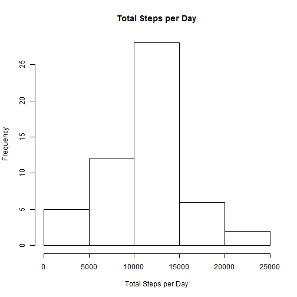
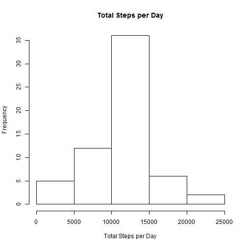
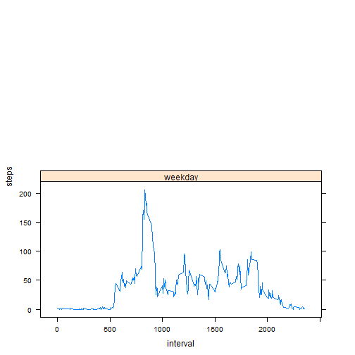

# Reproducible Research: Peer Assessment 1

## Loading and preprocessing the data 


```r
activity <- read.csv("activity.csv", header = TRUE)
activity$date <- as.POSIXct(activity$date)
```


## What is mean total number of steps taken per day?


```r
totalSteps <- with(activity, aggregate(steps ~ date, FUN = sum, na.rm = TRUE)[, 
    2])
hist(totalSteps, main = "Total Steps per Day", xlab = "Total Steps per Day")
```

 

```r

totalStepsStats <- list(mean = {
}, median = {
})
totalStepsStats[[1]] <- mean(totalSteps)
totalStepsStats[[2]] <- median(totalSteps)
print(totalStepsStats)
```

```
## $mean
## [1] 10766
## 
## $median
## [1] 10765
```


## What is the average daily activity pattern?


```r
intervalSteps <- with(activity, aggregate(steps ~ interval, FUN = mean, na.rm = TRUE))
with(intervalSteps, plot(steps ~ interval, type = "l"))
```

 

```r

maximumActivity <- intervalSteps[intervalSteps$steps == max(intervalSteps$steps), 
    ]
print(maximumActivity[1, 1])
```

```
## [1] 835
```


## Imputing missing values


```r
NAs <- sum(is.na(activity))

noNA <- NULL
rows <- as.numeric(nrow(activity))
z <- 1
for (i in 1:rows) {
    if (!is.na(activity[z, 1])) {
        noNA[z] <- activity[z, 1]
    } else {
        a <- as.numeric(activity[z, 3])
        noNA[z] <- intervalSteps[intervalSteps$interval == a, 2]
    }
    z <- z + 1
}

activityNoNA <- activity
activityNoNA[, 1] <- noNA

totalStepsNoNA <- with(activityNoNA, aggregate(steps ~ date, FUN = sum)[, 2])
hist(totalStepsNoNA, main = "Total Steps per Day", xlab = "Total Steps per Day")
```

 

```r

totalStepsStatsNoNA <- list(mean = {
}, median = {
})
totalStepsStatsNoNA[[1]] <- mean(totalStepsNoNA)
totalStepsStatsNoNA[[2]] <- median(totalStepsNoNA)
print(totalStepsStatsNoNA)
```

```
## $mean
## [1] 10766
## 
## $median
## [1] 10766
```


## Are there differences in activity patterns between weekdays and weekends?


```r
weekday <- weekdays(activityNoNA$date)
activityNoNA$weekday <- ifelse(weekday == "Saturday" | weekday == "Sunday", 
    "weekend", "weekday")
activityNoNA$weekday <- factor(activityNoNA$weekday)

require(lattice)
```

```
## Loading required package: lattice
```

```r
intervalStepsNoNA <- with(activityNoNA, aggregate(steps ~ interval + weekday, 
    FUN = mean))
xyplot(steps ~ interval | weekday, data = intervalStepsNoNA, type = "l", layout = c(1, 
    2))
```

 

